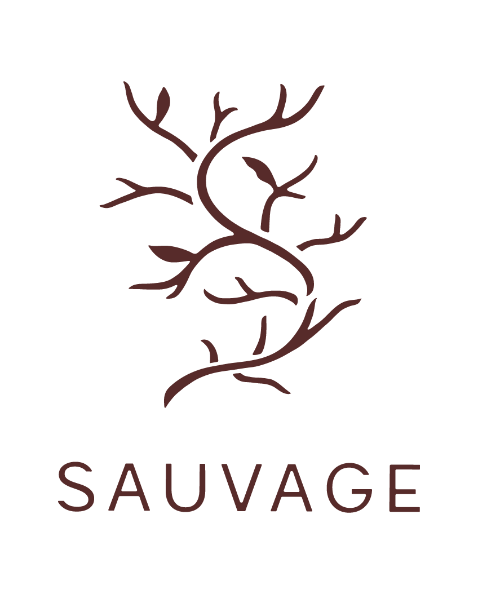

<a href="http://sauvage-restaurant.be"><h1>Sauvage-Restaurant</h1></a>

<h4><a href="https://github.com/ThomasBrose/Sauvage-Restaurant/tree/master/web">web</a></h4>
<h4><a href="https://github.com/ThomasBrose/Sauvage-Restaurant/tree/master/iOS">iOS</a></h4>
<h4><a href="https://github.com/ThomasBrose/Sauvage-Restaurant/tree/master/Android">Android</a></h4>

